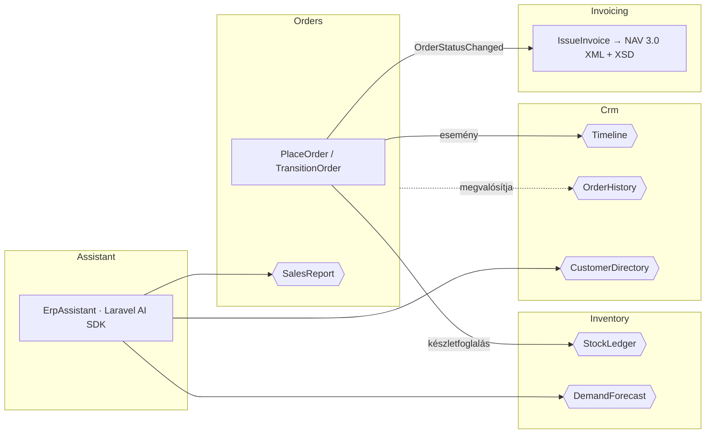

# Mini-ERP · moduláris Laravel 13

Rendelés-, készlet-, ügyfél- és számlakezelő rendszer egy kitalált irodatechnikai nagykereskedésnek. Öt önálló modulból áll:

- **NAV Online Számla 3.0 XML-t állít ki**, a hivatalos XSD-vel ellenőrizve.
- **Előre jelzi, mi fogy ki**, és mennyit kell rendelni.
- **Természetes nyelven kérdezhető** a Laravel hivatalos AI SDK-ján keresztül.

> Munkaminta az XTRADEVELOPERS Kft. Fullstack fejlesztő pozíciójára · Szilágyi Roland · waxeee57@gmail.com


## Röviden

| | |
|---|---|
| **Stack** | Laravel 13 · PHP 8.4 · Vue 3 · Vite · Tailwind CSS 4 · SQLite / MySQL / PostgreSQL |
| **Modulok** | `Crm` · `Inventory` · `Orders` · `Invoicing` · `Assistant`, mindegyik saját ServiceProviderrel, route-okkal, migrációkkal |
| **Domain-modell** | Modulonként `draft.yaml`, [Laravel Blueprint](https://blueprint.laravelshift.com)-tel, modulra szabott generátorral |
| **Adatbázis-diagram** | [`recca0120/laravel-erd`](https://github.com/recca0120/laravel-erd), `composer erd` |
| **Magyar számlázás** | NAV Online Számla 3.0 `InvoiceData` XML, offline XSD-validálással ([`pzs/nav-online-invoice`](https://github.com/pzs/nav-online-invoice)) |
| **AI** | [Laravel AI SDK](https://laravel.com/ai) (`laravel/ai`): eszközhasználó ERP-asszisztens és strukturált kimenetű ügyfél-összefoglaló, szolgáltató-függetlenül |
| **Előrejelzés** | Kifogyási dátum és javasolt rendelési mennyiség a készletmozgás-naplóból, prediktív riasztással |
| **Tesztek** | 65 teszt, 504 assertion: feature, unit, modulhatár- és 300 lépéses invariáns-teszt. CI: GitHub Actions + Pint |

## Indítás

```bash
git clone https://github.com/waxeee57-cyber/minierp.git && cd minierp
composer setup            # függőségek, .env, kulcs, SQLite, migráció, frontend build
php artisan db:seed       # 12 termék, 8 ügyfél, ~40 rendelés, a fizetettekhez NAV-számlával
php artisan serve         # http://localhost:8000
```

Tesztek: `composer test` · Kódstílus: `composer lint` · ERD: `composer erd`

Az AI-funkciókhoz elég egy kulcs a `.env`-ben (`ANTHROPIC_API_KEY=…`). Kulcs nélkül minden más működik, az ügyfél-összefoglaló pedig szabályalapúra vált.

## 5 perc alatt a kódban

1. [`modules/Orders/Actions/PlaceOrder.php`](modules/Orders/Actions/PlaceOrder.php): rendelés leadása egy tranzakcióban, készletfoglalással.
2. [`modules/Inventory/Services/EloquentStockLedger.php`](modules/Inventory/Services/EloquentStockLedger.php): soronkénti zárolás; minden készletváltozás naplózva.
3. [`modules/Invoicing/Services/NavInvoiceXmlBuilder.php`](modules/Invoicing/Services/NavInvoiceXmlBuilder.php) és [`NavSchemaValidator.php`](modules/Invoicing/Services/NavSchemaValidator.php): NAV 3.0 XML, cégnek és magánszemélynek.
4. [`modules/Assistant/Ai/ErpAssistant.php`](modules/Assistant/Ai/ErpAssistant.php): AI-ügynök, csak olvasó eszközökkel.
5. [`modules/Inventory/Services/MovementBasedForecast.php`](modules/Inventory/Services/MovementBasedForecast.php): magyarázható kifogyási előrejelzés.
6. [`tests/Architecture/ModuleBoundariesTest.php`](tests/Architecture/ModuleBoundariesTest.php): a modulhatárok automatikus őre.

## Modulok és határaik

A modulok a [moduláris Laravel](https://xtradevs.com/hu/blogok/laravel-modularizacio-az-alkalmazas-fejlesztes-alternativ-utja) mintát követik: `modules/` mappa, `Modules\` névtér, és minden modul egy „mini Laravel-app”. A provider tölti be a migrációkat, a route-okat, a parancsokat és az ütemezést. A providerek a Laravel 11+ szerinti `bootstrap/providers.php`-ban vannak regisztrálva.



- **Az Orders a készlethez csak a `StockLedger` szerződésen át nyúl**, a táblákat soha nem írja közvetlenül.
- **A CRM nem függ az Orders modultól.** A CRM definiálja az `OrderHistory` interfészt, az Orders pedig megvalósítja (függőség-megfordítás).
- **A számlázás eseményre reagál.** Az Orders modul nem tud a számlázásról, így ki-be kapcsolható.
- **Az AI-asszisztens csak szerződéseken át olvas, és nem írhat.** Nem fér hozzá a `StockLedger`-hez és a `Timeline`-hoz.
- Mindezt a [`ModuleBoundariesTest`](tests/Architecture/ModuleBoundariesTest.php) kényszeríti ki. Ha valaki átnyúl egy határon, a CI piros lesz.

## Számlázás: NAV Online Számla 3.0

Fizetett állapotba lépéskor az `Invoicing` modul automatikusan számlát állít ki:

- **Hézagmentes éves sorszám** (`SZ-2026-00001`), zárolással, tranzakción belül.
- **Tételenként kerekített 27% ÁFA.** Az összesítő a tételek összege, így a számla mindig belsőleg egyezik.
- **`InvoiceData` XML** a NAV 3.0 séma szerint:
  - Belföldi cégnél adószámmal, névvel és címmel (`DOMESTIC`).
  - Magánszemélynél a 3.0-s szabály szerint név és cím nélkül (`PRIVATE_PERSON`).
- **Offline XSD-validálás a NAV hivatalos sémafájljaival.** A hibás számla `invalid` állapotba kerül, és soha nem indul el a NAV felé.
  - Példa: fejlesztés közben a validátor fogta meg, hogy a NAV termékkódja csak `[A-Z0-9]` lehet, így az `IT-1001` cikkszámból `IT1001` lesz.
- **Lemondás fizetés után:** a számla nem törlődik, hanem `storno_required` állapotba kerül.
- **A beküldés** (`php artisan invoicing:submit`) technikai felhasználóval működik, alapból a NAV teszt-környezetébe. Hitelesítő adat nélkül biztonságosan nem csinál semmit. *A demó ezt a lépést nem futtatja; az ellenőrzés az XSD-ig tart.*

Végpontok: `GET /api/invoicing/invoices` · `GET /api/invoicing/invoices/{id}` · `GET /api/invoicing/invoices/{id}/xml`

## Kifogyási előrejelzés

A [`MovementBasedForecast`](modules/Inventory/Services/MovementBasedForecast.php) szándékosan egyszerű és ellenőrizhető:

```
napi kereslet      = (eladás − visszavét) az elmúlt 30 napban / 30
kitart             = készlet / napi kereslet
javasolt rendelés  = napi kereslet × (átfutás + biztonsági napok) − készlet
```

- **A riasztás prediktív:** az `inventory:low-stock-alert` nem csak azt jelzi, ami már a minimum alatt van, hanem azt is, ami a beszerzési átfutáson belül kifogy.
- A paraméterek `.env`-ből állíthatók (`ERP_FORECAST_WINDOW_DAYS`, `ERP_LEAD_TIME_DAYS`, `ERP_SAFETY_DAYS`).
- Végpont: `GET /api/inventory/forecast`

## AI: Laravel AI SDK

**ERP-asszisztens** (`POST /api/assistant/ask`): egy [`ErpAssistant`](modules/Assistant/Ai/ErpAssistant.php) ügynök, 5 csak olvasó eszközzel.

- **Az eszközök:** `FindCustomer`, `CustomerProfile`, `SalesSummary`, `StockOutlook` és `OpenTasks`.
- **Tipikus kérdések:** „Mi fogy ki a következő 7 napban, és mennyit rendeljek?”, „Ki volt a legjobb ügyfelünk az elmúlt 30 napban?”
- **Az utasítások tiltják a kitalálást**, és az eszközök nem adnak ki e-mail-címet vagy telefonszámot (tesztelve).

**Ügyfél-összefoglaló** ([`CustomerBriefAgent`](modules/Crm/Ai/CustomerBriefAgent.php)):

- **Strukturált kimenet** (`summary`, `next_action`), így a felület nem szabad szöveget értelmez.
- **Bármilyen hibánál szabályalapú tartalék.** Az eredmény addig van cache-elve, amíg az ügyfél idővonala nem változik.

**Közös tulajdonságok:**

- **Szolgáltató-függetlenség:** a szolgáltatót egy env-változó váltja (`ERP_AI_PROVIDER=anthropic|openai|gemini|…`).
- **Rate limit:** mindkét AI-végpont saját limitet kap (`throttle:ai`).
- **Tesztelés API-kulcs nélkül:** az SDK hivatalos fake-jeivel (`ErpAssistant::fake()`, `assertPrompted()`), az eszközöket pedig valós adaton, közvetlenül hívva.

## Amire még figyeltem

**Konzisztencia**
- A rendelés leadása egyetlen DB-tranzakció. Ha bármelyik tételből nincs elég, semmi nem íródik le.
- A foglalás `lockForUpdate`-tel zárolja a termék sorát, így két párhuzamos rendelés nem tudja eladni ugyanazt az utolsó darabot.
- **Invariáns-teszt:** 300 véletlen művelet után sem negatív a készlet, pontosan egyezik a mozgásnaplóval, és minden rendelés végösszege egyezik a tételei összegével.
- Pénz egész forintban; a tétel lemásolja a rendeléskori nevet és árat.

**Állapotgép**
- `OrderStatus` enum: *függőben → fizetve → kiszállítva*, lemondás a kiszállításig.
- Lemondáskor a készlet automatikusan visszakerül a raktárba. Dupla lemondásnál nincs dupla visszavételezés.

**Biztonság**
- FormRequest-validáció mindenhol, és `$fillable` mezők.
- Eladást, rendelés-bejegyzést és számlát kézzel nem lehet rögzíteni.
- Adószám-formátum ellenőrzése.
- `Model::shouldBeStrict()` fejlesztés közben.

**Ütemezés**
- A napi feladatok `withoutOverlapping()` és `onOneServer()` beállítással futnak, így több szerveren sem futnak duplán.

| Parancs | Mikor | Mit csinál |
|---|---|---|
| `inventory:low-stock-alert` | hétköznap 07:00 | Prediktív készletriasztás javasolt rendelési mennyiséggel |
| `crm:follow-ups` | naponta 08:00 | Utókövetési teendő, ha egy ügyfél X napja nem rendelt. Idempotens. |
| `invoicing:submit` | igény szerint | XSD-validált számlák beküldése a NAV-nak (csak beállított technikai felhasználóval) |

## Blueprint modulokra szabva

```bash
php artisan erp:blueprint Invoicing
```

A parancs a modul `draft.yaml`-jéből a modul névterébe generál modellt, migrációt és factory-t. A `timestamp` castokat `datetime`-ra javítja, és a `database/` mappában nem hagy szemetet (tesztelve). Az `Invoicing` modul váza is így készült.

## Adatbázis


## API

| Metódus | Útvonal | Leírás |
|---|---|---|
| GET | `/api/dashboard` | KPI-k, 14 napos bevétel |
| GET · POST | `/api/orders` | Lista (`status`, `customer_id`) · új rendelés |
| GET · PATCH | `/api/orders/{id}` · `/api/orders/{id}/status` | Részletek · állapotváltás |
| GET · POST | `/api/inventory/products` | Lista (`low_stock`, `search`) · új termék |
| POST | `/api/inventory/products/{id}/movements` | Bevételezés / korrekció |
| GET | `/api/inventory/forecast` | Kifogyási előrejelzés |
| GET · POST | `/api/crm/customers` | Lista · új ügyfél (adószámmal) |
| POST · PATCH | `/api/crm/customers/{id}/interactions` · `…/{id}/complete` | Idővonal-bejegyzés · teendő lezárása |
| GET | `/api/crm/customers/{id}/summary` | AI-összefoglaló |
| GET | `/api/invoicing/invoices` · `/{id}` · `/{id}/xml` | Számlák, NAV XML |
| POST | `/api/assistant/ask` | Természetes nyelvű kérdés az ERP-nek |

## Képernyők


| Rendelés NAV-számlával | Új rendelés |
|---|---|
|  |  |
| **Készlet előrejelzéssel** | **Ügyfél idővonal, összefoglaló, következő lépés** |
|  |  |

## Mit csinálnék a következő sprintben

- Sztornó számla (`STORNO` módosító okirat) a `storno_required` számlákhoz, és a NAV-tranzakció státuszának lekérdezése
- Hitelesítés Sanctummal, szerepkörök Policy-kkel (raktáros / értékesítő / könyvelő)
- Valós idejű vezérlőpult Laravel Reverbbel (új rendelés és készletváltozás push-ban)
- Böngészős végponttól-végpontig tesztek Pest 4-gyel
- Webshop-szinkron (WooCommerce/Shopify webhook → `PlaceOrder`), Elasticsearch-alapú termékkeresés nagy katalógushoz

## Fejlesztés

AI-asszisztált fejlesztéssel készült (Claude), ahogy a hirdetés is kéri. Az üzleti szabályokat és a modulhatárokat a tesztek rögzítik, így minden döntés ellenőrizhető.

Minden cég, személy és adószám kitalált.
