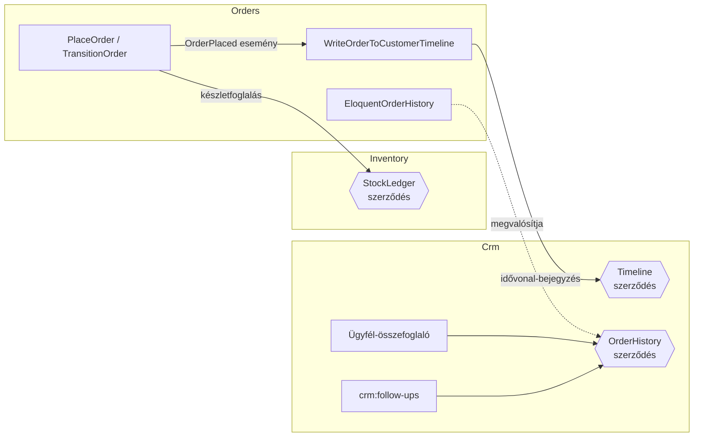

# Mini-ERP · moduláris Laravel

Rendelés-, készlet- és ügyfélkezelő rendszer egy kitalált irodatechnikai nagykereskedés számára. Három önálló modulból áll, REST API-n kommunikál egy Vue.js felülettel, ütemezett feladatokat futtat, és AI-val foglalja össze az ügyfelek helyzetét.

> Munkaminta az XTRADEVELOPERS Kft. Fullstack fejlesztő pozíciójára. Szilágyi Roland · waxeee57@gmail.com


## Röviden

| | |
|---|---|
| **Stack** | Laravel 13 · PHP 8.4 · Vue 3 · Vite · Tailwind CSS 4 · SQLite / MySQL / PostgreSQL |
| **Architektúra** | 3 modul (`modules/Crm`, `modules/Inventory`, `modules/Orders`), mindegyik saját ServiceProviderrel, route-okkal, migrációkkal |
| **Domain-modell** | Modulonként `draft.yaml`, [Laravel Blueprint](https://blueprint.laravelshift.com)-tel generálva |
| **Adatbázis-diagram** | [`recca0120/laravel-erd`](https://github.com/recca0120/laravel-erd), `composer erd` |
| **Tesztek** | 36 teszt, 255 assertion: feature, unit és modulhatár-teszt. CI: GitHub Actions + Pint |
| **Ütemezés** | Napi készletriasztás és ügyfél-utókövetés a Laravel Schedulerrel |
| **AI** | Ügyfél-összefoglaló a Claude API-val, kulcs nélkül vagy hiba esetén szabályalapú tartalékkal |

## Indítás

```bash
git clone https://github.com/waxeee57-cyber/mini-erp.git && cd mini-erp
composer setup            # függőségek, .env, kulcs, migráció, frontend build
php artisan db:seed       # bemutató adatok: 12 termék, 8 ügyfél, ~40 rendelés
php artisan serve         # http://localhost:8000
```

Tesztek: `composer test` · Kódstílus: `composer lint` · ERD újragenerálása: `composer erd`

## Modulok

A modulok a [moduláris Laravel](https://xtradevs.com/hu/blogok/laravel-modularizacio-az-alkalmazas-fejlesztes-alternativ-utja) mintát követik: `modules/` mappa, `Modules\` névtér a `composer.json`-ban, és minden modul egy „mini Laravel-app”. A provider tölti be a migrációkat (`loadMigrationsFrom`) és a route-okat, regisztrálja a parancsokat és az ütemezést. A providerek a Laravel 11+ szerinti helyen, a `bootstrap/providers.php`-ban vannak regisztrálva.

```
modules/Orders
├── Actions/            PlaceOrder, TransitionOrder – az üzleti logika egy helyen
├── Database/
│   ├── Factories/
│   └── migrations/
├── Enums/              OrderStatus – állapotgép az engedélyezett átmenetekkel
├── Events/  Listeners/
├── Http/               Controllers, Requests (validáció), Resources (API-válasz)
├── Models/
├── Providers/OrdersServiceProvider.php
├── Services/
├── routes/api.php
└── draft.yaml          a modul domain-modellje (Blueprint)
```

### Hogyan beszélnek egymással a modulok



- **Az Orders a készlethez csak a `StockLedger` szerződésen át nyúl**, a `stock_movements` táblát soha nem írja közvetlenül.
- **A CRM nem függ az Orders modultól.** A CRM definiálja az `OrderHistory` interfészt, az Orders pedig megvalósítja (függőség-megfordítás). Így a CRM önállóan is tesztelhető és cserélhető.
- **A határokat teszt őrzi.** A `tests/Architecture/ModuleBoundariesTest.php` elbukik, ha egy modul átnyúl a másikba.

## Amire figyeltem

**Pénz és készlet konzisztenciája**
- Egy rendelés leadása egyetlen DB-tranzakció. Ha bármelyik tételből nincs elég, semmi nem íródik le, az előző tételek foglalása sem (tesztelve).
- A foglalás `lockForUpdate`-tel zárolja a termék sorát, így két párhuzamos rendelés nem tudja eladni ugyanazt az utolsó darabot.
- A készlet minden változása egy `stock_movements` sor. A termék készlete mindig a mozgások összege, ezt a tesztek ellenőrzik.
- Az összegek egész forintban, `unsignedInteger`-ként vannak tárolva, lebegőpontos kerekítési hiba nélkül.
- A rendelési tétel lemásolja a termék nevét és árát. Egy későbbi árváltozás nem írja át a régi rendeléseket.

**Állapotgép**
- `OrderStatus` enum: *függőben → fizetve → kiszállítva*, lemondani a kiszállításig lehet. Az engedélyezett átmenetek egy helyen vannak definiálva, az API és a felület is ebből dolgozik.
- Érvénytelen átmenetnél 422-es válasz jön az engedélyezett lépések listájával.
- Lemondáskor a lefoglalt készlet automatikusan visszakerül a raktárba. Dupla lemondásnál nincs dupla visszavételezés.

**Biztonság**
- Minden bemenet FormRequestben validálva, `$fillable` mezőkkel.
- Eladást és rendelés-bejegyzést kézzel nem lehet rögzíteni, csak a rendelési folyamat hozhatja létre.
- Az AI-végpont saját rate limitet kap (`throttle:ai`).
- Az AI csak strukturált összesítőt kap, e-mail-címet és telefonszámot nem (tesztelve).
- `Model::shouldBeStrict()` fejlesztés közben: az N+1 lekérdezés és az elgépelt attribútum azonnal kivételt dob.

## Blueprint modulokra szabva

A Blueprint alapból az `app/` és a `database/` mappába generál. Írtam hozzá egy parancsot, amely modulra szabva futtatja:

```bash
php artisan erp:blueprint Orders
```

A parancs a `modules/Orders/draft.yaml`-ből dolgozik. A modelleket a modul névterébe generálja, a migrációkat és a factory-ket átmozgatja a modul `Database` mappájába, és a `timestamp` castokat `datetime`-ra javítja. A generált vázat utána kézzel egészítettem ki üzleti logikával, enumokkal és kapcsolatokkal. Forrás: [`app/Console/Commands/ModuleBlueprintCommand.php`](app/Console/Commands/ModuleBlueprintCommand.php)

## Adatbázis


## Ütemezett feladatok

| Parancs | Mikor | Mit csinál |
|---|---|---|
| `inventory:low-stock-alert` | hétköznap 07:00 | E-mailt küld a raktárnak az újrarendelési szint alá esett aktív termékekről |
| `crm:follow-ups` | naponta 08:00 | Utókövetési teendőt hoz létre, ha egy ügyfél X napja nem rendelt, és azóta senki nem kereste. Idempotens, nem duplikál. |

Élesben ehhez egyetlen cron-sor kell: `* * * * * php artisan schedule:run`.

## AI-összefoglaló

`GET /api/crm/customers/{id}/summary`

- Az ügyfél adatlapján egy-két mondatos helyzetkép jelenik meg, egy javasolt következő lépéssel.
- **Claude API**, ha az `ANTHROPIC_API_KEY` és az `ANTHROPIC_MODEL` be van állítva. A prompt tiltja a kitalálást, és csak a kapott tényekből dolgozhat.
- **Szabályalapú tartalék**, ha nincs kulcs, vagy az API hibát ad. A felület így sosem marad üres.
- Az eredmény addig van cache-elve, amíg az ügyfél idővonala nem változik. Így nem fizetünk kétszer ugyanazért az összefoglalóért (tesztelve).

## API

| Metódus | Útvonal | Leírás |
|---|---|---|
| GET | `/api/dashboard` | KPI-k, 14 napos bevétel |
| GET · POST | `/api/orders` | Lista (szűrés: `status`, `customer_id`) · új rendelés |
| GET | `/api/orders/{id}` | Rendelés tételekkel |
| PATCH | `/api/orders/{id}/status` | Állapotváltás az állapotgép szerint |
| GET · POST | `/api/inventory/products` | Lista (`low_stock`, `search`) · új termék |
| GET · PUT | `/api/inventory/products/{id}` | Részletek mozgásnaplóval · módosítás |
| POST | `/api/inventory/products/{id}/movements` | Bevételezés vagy korrekció |
| GET · POST | `/api/crm/customers` | Lista (`search`) · új ügyfél |
| GET · PUT | `/api/crm/customers/{id}` | Adatlap idővonallal · módosítás |
| POST | `/api/crm/customers/{id}/interactions` | Hívás, e-mail, találkozó, jegyzet, teendő |
| PATCH | `/api/crm/customers/{id}/interactions/{id}/complete` | Teendő lezárása |
| GET | `/api/crm/customers/{id}/summary` | AI-összefoglaló |

Példa:

```bash
curl -X POST localhost:8000/api/orders -H 'Content-Type: application/json' -H 'Accept: application/json' \
  -d '{"customer_id":1,"items":[{"product_id":2,"quantity":3}]}'
```

## Képernyők

| Rendelés részletei | Új rendelés |
|---|---|
|  |  |
| **Készlet** | **Ügyfél idővonal és AI-összefoglaló** |
|  |  |

## Mit csinálnék a következő sprintben

- Hitelesítés Sanctummal és szerepkörök (raktáros / értékesítő / admin) Policy-kkel
- Számla-PDF és NAV Online Számla-integráció a fizetett rendelésekhez
- Webshop-szinkron (pl. WooCommerce/Shopify webhook → `PlaceOrder`)
- Elasticsearch-alapú termékkeresés nagy katalógushoz
- A riasztások és az AI-hívások queue-ba tétele, Horizonnal monitorozva

## Fejlesztés

AI-asszisztált fejlesztéssel készült (Claude), ahogy a hirdetés is kéri. Az üzleti szabályokat és a modulhatárokat a tesztek rögzítik, így minden döntés ellenőrizhető.

Minden cég, személy és adat kitalált.
