# Mini-ERP · moduláris Laravel 13

Rendelés-, készlet-, ügyfél- és számlakezelő rendszer egy kitalált irodatechnikai nagykereskedésnek. Hat önálló modulból áll:

- **NAV Online Számla 3.0 XML-t állít ki**, a hivatalos XSD-vel ellenőrizve.
- **Előre jelzi, mi fogy ki**, és mennyit kell rendelni.
- **Webshopokhoz kapcsolódik:** Shopify- és WooCommerce-rendeléseket vesz át aláírt webhookkal, Google Shopping- és Árukereső-feedet ad, és marketingforrás szerint méri a bevételt.
- **Természetes nyelven kérdezhető** a Laravel hivatalos AI SDK-ján keresztül – API-kulcs nélkül is, szabályalapú módban.
- **Termékszintű felülettel:** ⌘K parancspaletta, mélylinkek, sötét mód, mobil nézet, papírhű számlakép és NAV XML-néző.

> ### ▶ Élő demó: **[szilagyi-mini-erp.vercel.app](https://szilagyi-mini-erp.vercel.app)**
> Telepítés és regisztráció nélkül kattintható, a demóadatbázis óránként friss bemutató adatokkal újraépül. Az ingyenes tárhely példányai külön adatbázissal futnak, ezért egy frissen rögzített tétel nem mindig látszik a következő kattintásra ([részletek](#élő-demó-a-vercelen)); a teljes folyamat helyben, egy paranccsal fut.

[](https://github.com/waxeee57-cyber/minierp/actions/workflows/tests.yml)

Munkaminta · Szilágyi Roland · waxeee57@gmail.com

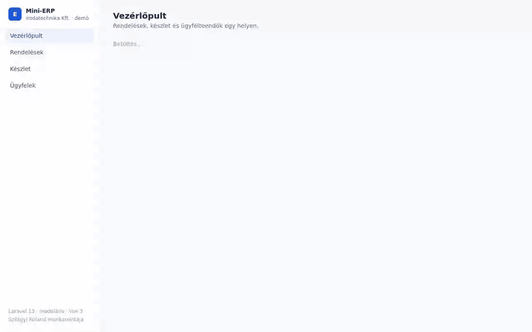

## Röviden

| | |
|---|---|
| **Stack** | Laravel 13 · PHP 8.4 · Vue 3 + Vue Router · Vite · Tailwind CSS 4 · SQLite / MySQL / PostgreSQL |
| **Modulok** | `Crm` · `Inventory` · `Orders` · `Invoicing` · `Assistant` · `Channels`, mindegyik saját ServiceProviderrel, route-okkal, migrációkkal |
| **Domain-modell** | Modulonként `draft.yaml`, [Laravel Blueprint](https://blueprint.laravelshift.com)-tel, modulra szabott generátorral |
| **Adatbázis-diagram** | [`recca0120/laravel-erd`](https://github.com/recca0120/laravel-erd), `composer erd` |
| **Magyar számlázás** | NAV Online Számla 3.0 `InvoiceData` XML, offline XSD-validálással ([`pzs/nav-online-invoice`](https://github.com/pzs/nav-online-invoice)) |
| **AI** | [Laravel AI SDK](https://laravel.com/ai) (`laravel/ai`): eszközhasználó ERP-asszisztens és strukturált kimenetű ügyfél-összefoglaló, szolgáltató-függetlenül |
| **Előrejelzés** | Kifogyási dátum és javasolt rendelési mennyiség a készletmozgás-naplóból, prediktív riasztással |
| **Webshop-integráció** | Shopify és WooCommerce webhook HMAC-aláírással, idempotens átvétellel · Google Merchant Center és Árukereső XML-feed · UTM-alapú bevételi riport |
| **Tesztek** | 90 PHPUnit-teszt (~1300 assertion): feature, unit, modulhatár-, 300 lépéses invariáns- és bemutatóadat-konzisztencia-teszt · 10 böngészős Playwright-teszt asztali és mobil nézetben. CI: GitHub Actions (SQLite és PostgreSQL 16), Pint |
| **Felület** | Lighthouse (mobil emuláció, 5 fő oldal): Accessibility **100**, Best Practices **100**, SEO **100**, CLS ≤ 0,085 |

## Indítás

```bash
git clone https://github.com/waxeee57-cyber/minierp.git && cd minierp
composer setup            # függőségek, .env, kulcs, SQLite, migráció, frontend build
php artisan db:seed       # 12 termék, 8 céges ügyfél, ~70 rendelés 65 napra + 16 webshop-rendelés, NAV-számlákkal
php artisan serve         # http://localhost:8000
```

Tesztek: `composer test` · Böngészős tesztek: `npm run e2e` · Kódstílus: `composer lint` · ERD: `composer erd`

Az AI-funkciókhoz elég egy kulcs a `.env`-ben (`ANTHROPIC_API_KEY=…`). **Kulcs nélkül is minden működik:** az asszisztens és az ügyfél-összefoglaló szabályalapú módra vált, ugyanazokkal a csak olvasó eszközökkel, és a felület mindig jelzi, melyik mód válaszolt.

### Élő demó a Vercelen

A demó a `main` ág minden pusholásakor automatikusan frissül. A Vercel függvények fájlrendszere csak olvasható, ezért az [`api/index.php`](api/index.php) belépő:

- minden írható útvonalat (storage, cache-fájlok, SQLite) a `/tmp` alá irányít;
- hidegindításkor és óránként külön folyamatban migrál és seedel egy ideiglenes fájlba, majd atomikusan a helyére nevezi, így kérés sosem lát félkész adatbázist;
- a repóban nincs titok: `APP_KEY` hiányában példányonként véletlen kulcsot készít (az API állapotmentes).

[`vercel.json`](vercel.json): [`vercel-php`](https://github.com/vercel-community/php) futtatókörnyezet, a Vite-build statikusan, `immutable` gyorsítótárral. A Laravel AI SDK által behúzott AWS SDK-t a build a `BedrockRuntime`/`Sts` szolgáltatásra szűkíti, hogy a függvény beférjen a méretkorlátba.

Tudatos korlát: a Vercel párhuzamos kéréseknél több példányt indít, és mindegyik saját SQLite-fájllal dolgozik, így az írások nem közösek (olvasásra a demó teljes értékű). Éles üzemhez közös MySQL vagy PostgreSQL kell; a teljes tesztsor a CI-ban PostgreSQL 16-on is fut, kódmódosítás nem kell hozzá, csak a `DB_*` változók.

A böngészős tesztek bármely környezet ellen futtathatók: `E2E_BASE_URL=https://… npm run e2e`

## 5 perc alatt a kódban

1. [`modules/Orders/Actions/PlaceOrder.php`](modules/Orders/Actions/PlaceOrder.php): rendelés leadása egy tranzakcióban, készletfoglalással.
2. [`modules/Inventory/Services/EloquentStockLedger.php`](modules/Inventory/Services/EloquentStockLedger.php): soronkénti zárolás; minden készletváltozás naplózva.
3. [`modules/Invoicing/Services/NavInvoiceXmlBuilder.php`](modules/Invoicing/Services/NavInvoiceXmlBuilder.php) és [`NavSchemaValidator.php`](modules/Invoicing/Services/NavSchemaValidator.php): NAV 3.0 XML, cégnek és magánszemélynek.
4. [`modules/Assistant/Ai/ErpAssistant.php`](modules/Assistant/Ai/ErpAssistant.php): AI-ügynök, csak olvasó eszközökkel.
5. [`modules/Inventory/Services/MovementBasedForecast.php`](modules/Inventory/Services/MovementBasedForecast.php): magyarázható kifogyási előrejelzés.
6. [`modules/Channels/Actions/ImportChannelOrder.php`](modules/Channels/Actions/ImportChannelOrder.php): idempotens webshop-rendelésátvétel, ugyanazon az úton, mint a kézi rendelés.
7. [`tests/Architecture/ModuleBoundariesTest.php`](tests/Architecture/ModuleBoundariesTest.php): a modulhatárok automatikus őre.

## Felület

A Vue 3 felület egy valódi napi munkaeszköz mintájára készült (Linear, Stripe Dashboard), nem admin-sablon:

- **⌘K / Ctrl+K parancspaletta:** modulokon átívelő keresés (ügyfél, termék, rendelés, számla egy végponton), gyorsműveletek, és ha nincs találat, a kérdés egy kattintással az ERP-asszisztenshez megy.
- **Billentyűparancsok:** `C` új rendelés, `G` + `D/O/K/U/S` ugrás, `Esc` bezárás.
- **Mélylinkek:** minden rendelés, termék, ügyfél és számla saját URL-t kap (`/orders/42`, `/invoices/7`), szűrőkkel együtt megosztható.
- **Oldalpanelek modálok helyett:** a lista a háttérben marad, a panel fókuszcsapdával, Esc-kel és egymásra nyitható módon működik.
- **Rendelés-életút:** leadva → fizetve → kiszállítva idővonallal, lemondás kétlépéses megerősítéssel.
- **Új rendelés élő készletellenőrzéssel:** kereshető termékválasztó, ékezet-független keresés, összesített mennyiség szerinti hiányjelzés (mint a szerveren), nettó/ÁFA/bruttó élőben.
- **Számla két nézetben:** nyomtatható, papírhű számlakép és szintaxiskiemelt NAV `InvoiceData` XML másolással, letöltéssel.
- **Grafikonok grafikonkönyvtár nélkül:** saját SVG-komponens monoton köbös görbével (nem lő 0 alá), valós idejű tengellyel a készlettörténetnél, egér- és érintésvezérelt tooltippel.
- **Sötét mód** szemantikus design tokenekkel, villanás nélkül; **mobil nézet** alsó fülsávval, kártyás listákkal.
- **Magyar mindenhol:** validációs üzenetek (`lang/hu`), számformátum, relatív idők („tegnap 14:20”).
- **Mérve:** Lighthouse Accessibility / Best Practices / SEO 100 mind az öt mért fő oldalon; a betűtípus előtöltve, metrikailag illesztett tartalékkal, így nincs elrendezés-ugrás. Fő JS-csomag 48 kB gzip, oldalanként kódfelosztással.

## Modulok és határaik

A modulok a [moduláris Laravel](https://xtradevs.com/hu/blogok/laravel-modularizacio-az-alkalmazas-fejlesztes-alternativ-utja) mintát követik: `modules/` mappa, `Modules\` névtér, és minden modul egy „mini Laravel-app”. A provider tölti be a migrációkat, a route-okat, a parancsokat és az ütemezést. A providerek a Laravel 11+ szerinti `bootstrap/providers.php`-ban vannak regisztrálva.

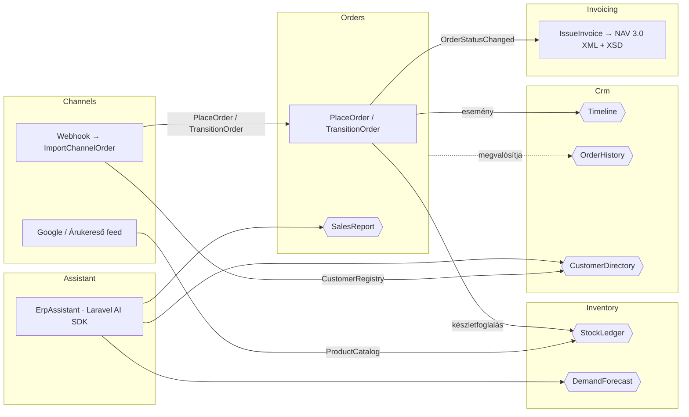

- **Az Orders a készlethez csak a `StockLedger` szerződésen át nyúl**, a táblákat soha nem írja közvetlenül.
- **A CRM nem függ az Orders modultól.** A CRM definiálja az `OrderHistory` interfészt, az Orders pedig megvalósítja (függőség-megfordítás).
- **A számlázás eseményre reagál.** Az Orders modul nem tud a számlázásról, így ki-be kapcsolható.
- **Az AI-asszisztens csak szerződéseken át olvas, és nem írhat.** Nem fér hozzá a `StockLedger`-hez, a `Timeline`-hoz és a `CustomerRegistry`-hez.
- **A webshop-csatornák** csak szerződésen (`ProductCatalog`, `CustomerRegistry`) és publikus akción (`PlaceOrder`, `TransitionOrder`) át érnek más modulhoz; az Orders nem tud róluk.
- Mindezt a [`ModuleBoundariesTest`](tests/Architecture/ModuleBoundariesTest.php) kényszeríti ki. Ha valaki átnyúl egy határon, a CI piros lesz.

## Számlázás: NAV Online Számla 3.0

Fizetett állapotba lépéskor az `Invoicing` modul automatikusan számlát állít ki:

- **Hézagmentes éves sorszám** (`SZ-2026-00001`), zárolással, tranzakción belül.
- **Tételenként kerekített 27% ÁFA.** Az összesítő a tételek összege, így a számla mindig belsőleg egyezik.
- **`InvoiceData` XML** a NAV 3.0 séma szerint:
  - Belföldi cégnél adószámmal, névvel és címmel (`DOMESTIC`).
  - Magánszemélynél a 3.0-s szabály szerint név és cím nélkül (`PRIVATE_PERSON`).
- **Offline XSD-validálás a NAV hivatalos sémafájljaival.** A hibás számla `invalid` állapotba kerül, és soha nem indul el a NAV felé.
  - Példa: fejlesztés közben a validátor fogta meg, hogy a NAV termékkódja csak `[A-Z0-9]` lehet, így az `IT-1001` cikkszámból `IT1001` lesz.
- **Lemondás fizetés után:** a számla nem törlődik, hanem `storno_required` állapotba kerül.
- **A beküldés** (`php artisan invoicing:submit`) technikai felhasználóval működik, alapból a NAV teszt-környezetébe. Hitelesítő adat nélkül biztonságosan nem csinál semmit. *A demó ezt a lépést nem futtatja; az ellenőrzés az XSD-ig tart.*

Végpontok: `GET /api/invoicing/invoices` · `GET /api/invoicing/invoices/{id}` · `GET /api/invoicing/invoices/{id}/xml`

## Webshop-integráció

A `Channels` modul egy webshop mögötti ERP tipikus feladatait oldja meg:

- **Rendelésátvétel webhookkal** (`POST /api/channels/{shopify|woocommerce}/orders`):
  - **Hitelesítés:** `base64(HMAC-SHA256)` aláírás a platform saját fejlécében (`X-Shopify-Hmac-Sha256`, `X-WC-Webhook-Signature`), időálló összehasonlítással. Titok nélkül a csatorna minden kérést elutasít.
  - **Idempotencia:** a webshopok újrapróbálkoznak, ezért `(channel, external_id)` egyedi index és ütközéskezelés véd a dupla rendeléstől és a dupla készletfoglalástól, párhuzamos kézbesítésnél is.
  - **Ugyanaz az út, mint a kézi rendelésnél:** `PlaceOrder` (tranzakció, soronkénti zárolás, CRM-idővonal), fizetett rendelésnél `TransitionOrder` → automatikus NAV-számla. Adószám nélküli vevőnél `PRIVATE_PERSON` számla.
  - **Ami nem importálható, nem vész el:** ismeretlen cikkszám vagy készlethiány esetén „elutasítva” állapotba kerül, okkal együtt, mellékhatás nélkül (az ügyfél sem jön létre). A válasz 200, hogy a webshop ne küldje újra; a döntés az ERP-ben születik.
  - Az ügyfelet e-mail-cím alapján keresi vagy hozza létre; meglévő ügyfél adatait nem írja felül. Magyar címnél magyar névsorrend.
- **Termékfeedek** élő készlettel és bruttó árral: `GET /feeds/google-merchant.xml` (RSS 2.0, `g:` névtér) és `GET /feeds/arukereso.xml` (az Árukereső kötelező mezőivel: `identifier`, `manufacturer`, `category`, `price`, `netprice` …).
- **Marketing-riport** (`GET /api/channels/report`): bevétel csatornánként és UTM-forrásonként. A Shopify a `landing_site` URL-jéből, a WooCommerce a beépített rendelés-attribúcióból (`_wc_order_attribution_utm_*`) adja a forrást.

Beállítás a `.env`-ben: `SHOPIFY_WEBHOOK_SECRET`, `WOOCOMMERCE_WEBHOOK_SECRET`, `ERP_SHOP_URL`.

**Kipróbálás az élő demón** – aláírt Shopify-rendelés, fizetve, Google Ads forrással (a demó titka `demo-shopify-secret`). Másodszori futtatásra `"duplicate": true` jön vissza, új rendelés nem keletkezik:

```bash
BODY='{"id":9001001,"name":"#1001","email":"teszt.vevo@example.hu","financial_status":"paid","landing_site":"/?utm_source=google&utm_medium=cpc","billing_address":{"first_name":"Anna","last_name":"Kovács","country_code":"HU","zip":"1051","city":"Budapest","address1":"Váci utca 1."},"line_items":[{"sku":"IT-1008","quantity":2}]}'
SIG=$(printf '%s' "$BODY" | openssl dgst -sha256 -hmac 'demo-shopify-secret' -binary | base64)
curl https://szilagyi-mini-erp.vercel.app/api/channels/shopify/orders \
  -H 'Content-Type: application/json' -H "X-Shopify-Hmac-Sha256: $SIG" -d "$BODY"
```

## Kifogyási előrejelzés

A [`MovementBasedForecast`](modules/Inventory/Services/MovementBasedForecast.php) szándékosan egyszerű és ellenőrizhető:

```
napi kereslet      = (eladás − visszavét) az elmúlt 30 napban / 30
kitart             = készlet / napi kereslet
javasolt rendelés  = napi kereslet × (átfutás + biztonsági napok) − készlet
```

- **A riasztás prediktív:** az `inventory:low-stock-alert` nem csak azt jelzi, ami már a minimum alatt van, hanem azt is, ami a beszerzési átfutáson belül kifogy.
- A paraméterek `.env`-ből állíthatók (`ERP_FORECAST_WINDOW_DAYS`, `ERP_LEAD_TIME_DAYS`, `ERP_SAFETY_DAYS`).
- Végpont: `GET /api/inventory/forecast`

## AI: Laravel AI SDK

**ERP-asszisztens** (`POST /api/assistant/ask`): egy [`ErpAssistant`](modules/Assistant/Ai/ErpAssistant.php) ügynök, 5 csak olvasó eszközzel.

- **Kulcs nélkül vagy szolgáltatói hibánál** a [`RuleBasedAssistant`](modules/Assistant/Services/RuleBasedAssistant.php) válaszol: kulcsszavas szándékfelismerés, majd *ugyanazok* az eszközök. A válasz jelzi a módot (`ai` / `rules`) és a felhasznált eszközöket, így a forrás mindig ellenőrizhető.

- **Az eszközök:** `FindCustomer`, `CustomerProfile`, `SalesSummary`, `StockOutlook` és `OpenTasks`.
- **Tipikus kérdések:** „Mi fogy ki a következő 7 napban, és mennyit rendeljek?”, „Ki volt a legjobb ügyfelünk az elmúlt 30 napban?”
- **Az utasítások tiltják a kitalálást**, és az eszközök nem adnak ki e-mail-címet vagy telefonszámot (tesztelve).

**Ügyfél-összefoglaló** ([`CustomerBriefAgent`](modules/Crm/Ai/CustomerBriefAgent.php)):

- **Strukturált kimenet** (`summary`, `next_action`), így a felület nem szabad szöveget értelmez.
- **Bármilyen hibánál szabályalapú tartalék.** Az eredmény addig van cache-elve, amíg az ügyfél idővonala nem változik.

**Közös tulajdonságok:**

- **Szolgáltató-függetlenség:** a szolgáltatót egy env-változó váltja (`ERP_AI_PROVIDER=anthropic|openai|gemini|…`).
- **Rate limit:** mindkét AI-végpont saját limitet kap (`throttle:ai`).
- **Tesztelés API-kulcs nélkül:** az SDK hivatalos fake-jeivel (`ErpAssistant::fake()`, `assertPrompted()`), az eszközöket pedig valós adaton, közvetlenül hívva.

## Amire még figyeltem

**Konzisztencia**
- A rendelés leadása egyetlen DB-tranzakció. Ha bármelyik tételből nincs elég, semmi nem íródik le.
- A foglalás `lockForUpdate`-tel zárolja a termék sorát, így két párhuzamos rendelés nem tudja eladni ugyanazt az utolsó darabot.
- **Invariáns-teszt:** 300 véletlen művelet után sem negatív a készlet, pontosan egyezik a mozgásnaplóval, és minden rendelés végösszege egyezik a tételei összegével.
- Pénz egész forintban; a tétel lemásolja a rendeléskori nevet és árat.

**Állapotgép**
- `OrderStatus` enum: *függőben → fizetve → kiszállítva*, lemondás a kiszállításig.
- Lemondáskor a készlet automatikusan visszakerül a raktárba. Dupla lemondásnál nincs dupla visszavételezés.

**Biztonság**
- FormRequest-validáció mindenhol, és `$fillable` mezők.
- Eladást, rendelés-bejegyzést és számlát kézzel nem lehet rögzíteni.
- Adószám-formátum ellenőrzése.
- `Model::shouldBeStrict()` fejlesztés közben.

**Ütemezés**
- A napi feladatok `withoutOverlapping()` és `onOneServer()` beállítással futnak, így több szerveren sem futnak duplán.

| Parancs | Mikor | Mit csinál |
|---|---|---|
| `inventory:low-stock-alert` | hétköznap 07:00 | Prediktív készletriasztás javasolt rendelési mennyiséggel |
| `crm:follow-ups` | naponta 08:00 | Utókövetési teendő, ha egy ügyfél X napja nem rendelt. Idempotens. |
| `invoicing:submit` | igény szerint | XSD-validált számlák beküldése a NAV-nak (csak beállított technikai felhasználóval) |

## Blueprint modulokra szabva

```bash
php artisan erp:blueprint Invoicing
```

A parancs a modul `draft.yaml`-jéből a modul névterébe generál modellt, migrációt és factory-t. A `timestamp` castokat `datetime`-ra javítja, és a `database/` mappában nem hagy szemetet (tesztelve). Az `Invoicing` modul váza is így készült.

## Adatbázis

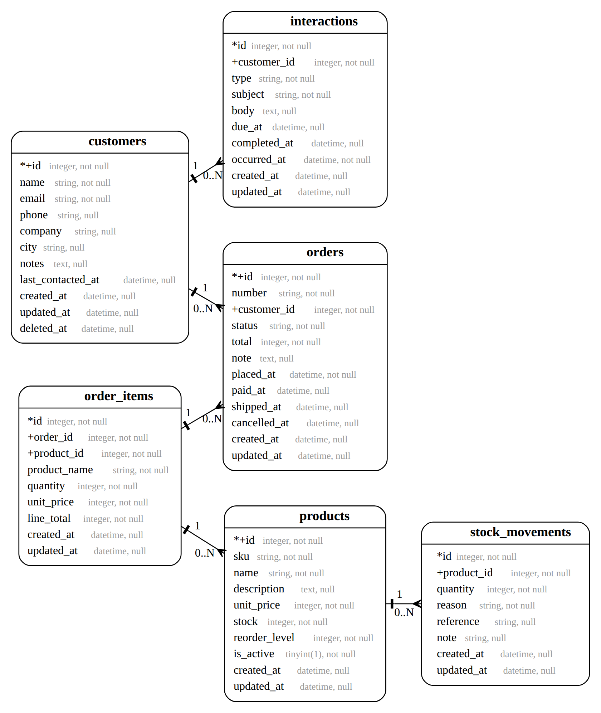

## API

| Metódus | Útvonal | Leírás |
|---|---|---|
| GET | `/api/dashboard?days=7\|14\|30\|90` | KPI-k, leadott vs. realizált bevétel naponta, előző időszak, top ügyfelek, teendők |
| GET | `/api/search?q=` | Globális keresés a parancspalettához (ügyfél, termék, rendelés, számla) |
| GET · POST | `/api/orders` | Lista (`status`, `customer_id`, `search`, állapotonkénti darabszám) · új rendelés |
| GET · PATCH | `/api/orders/{id}` · `/api/orders/{id}/status` | Részletek · állapotváltás |
| GET · POST · PATCH | `/api/inventory/products` · `/{id}` | Lista (`low_stock`, `search`) · új termék (0 készlettel) · részletek mozgásonkénti egyenleggel · módosítás |
| POST | `/api/inventory/products/{id}/movements` | Bevételezés / korrekció |
| GET | `/api/inventory/forecast` | Kifogyási előrejelzés |
| GET · POST · PATCH | `/api/crm/customers` · `/{id}` | Lista · új ügyfél (adószámmal) · részletek rendelési statisztikával · módosítás |
| POST · PATCH | `/api/crm/customers/{id}/interactions` · `…/{id}/complete` | Idővonal-bejegyzés · teendő lezárása |
| GET | `/api/crm/customers/{id}/summary` | AI-összefoglaló |
| GET | `/api/invoicing/invoices` · `/{id}` · `/{id}/xml` | Számlák, NAV XML |
| POST | `/api/assistant/ask` | Természetes nyelvű kérdés az ERP-nek |
| POST | `/api/channels/{shopify\|woocommerce}/orders` | Webshop-webhook (HMAC-aláírással) |
| GET | `/api/channels/orders` · `/api/channels/report` | Beérkezett webshop-rendelések · bevétel csatorna és marketingforrás szerint |
| GET | `/feeds/google-merchant.xml` · `/feeds/arukereso.xml` | Termékfeedek |

## Képernyők

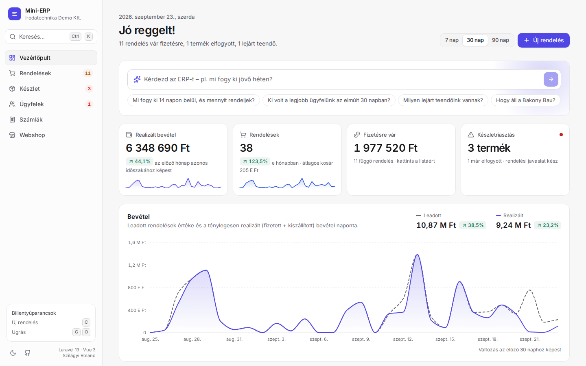

| ERP-asszisztens kulcs nélkül | ⌘K parancspaletta |
|---|---|
| 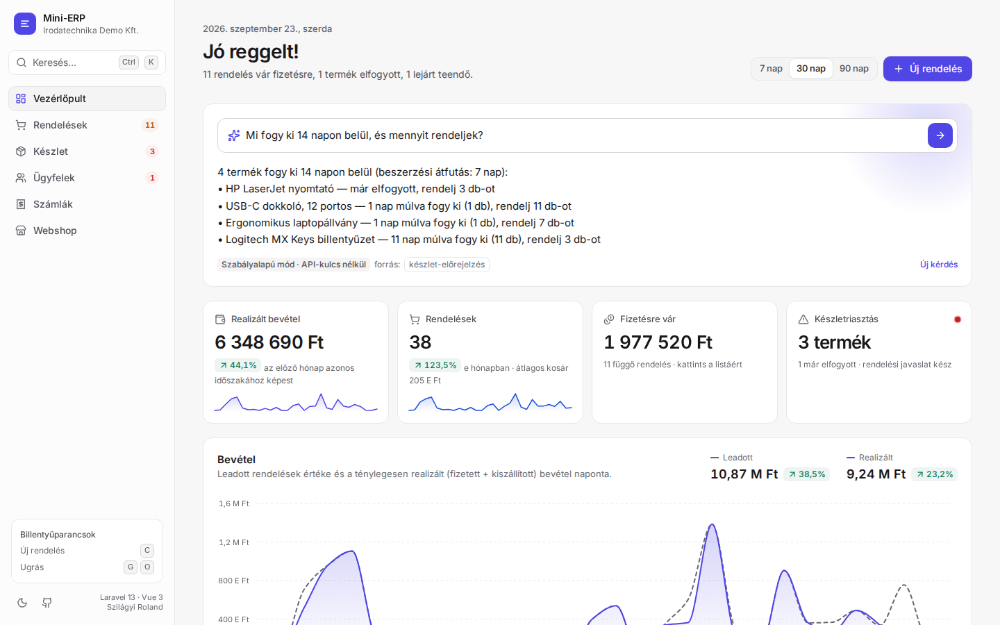 | 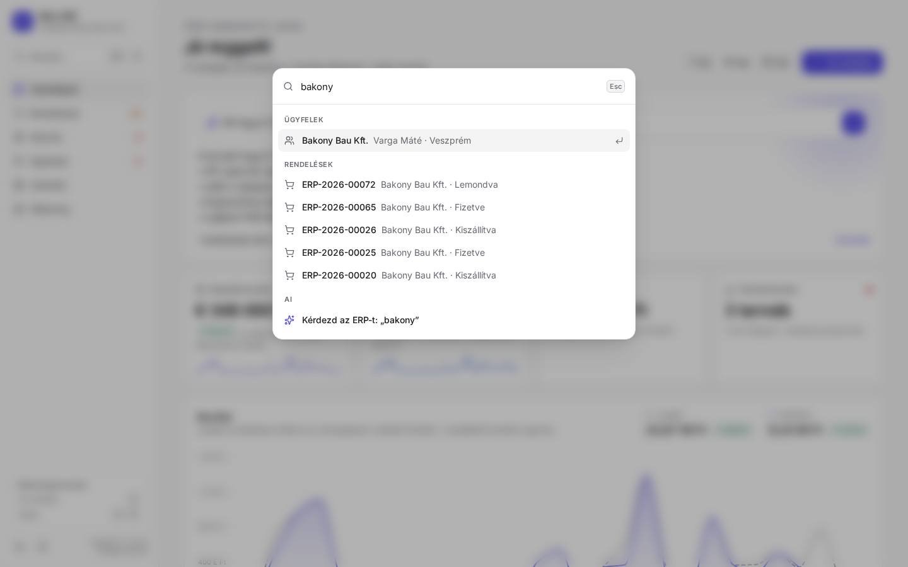 |
| **Új rendelés élő készletellenőrzéssel** | **Fizetés → automatikus NAV-számla** |
| 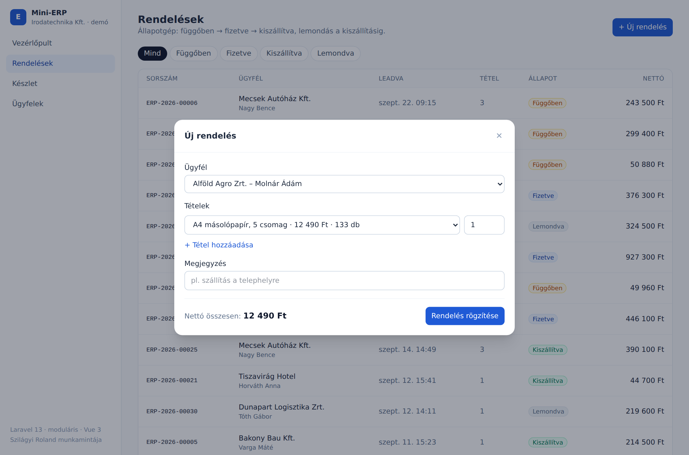 | 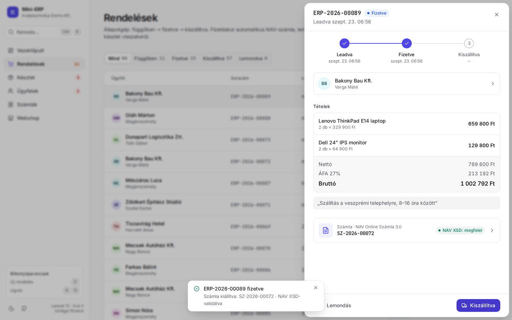 |
| **Papírhű számlakép** | **NAV Online Számla 3.0 XML** |
| 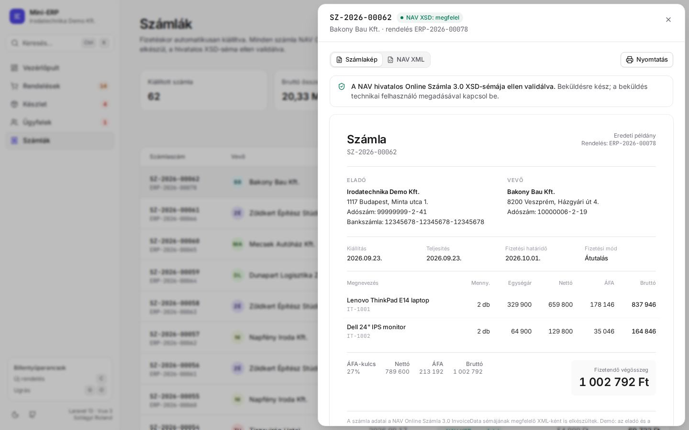 | 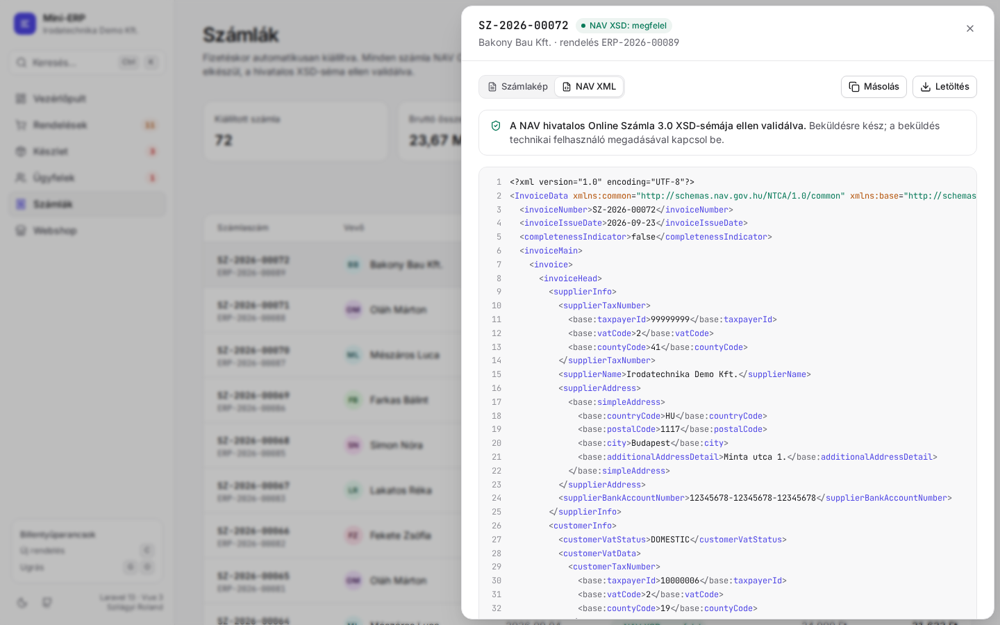 |
| **Készlet: előrejelzés, készlettörténet, napló** | **Ügyfél: helyzetkép, idővonal, teendők** |
| 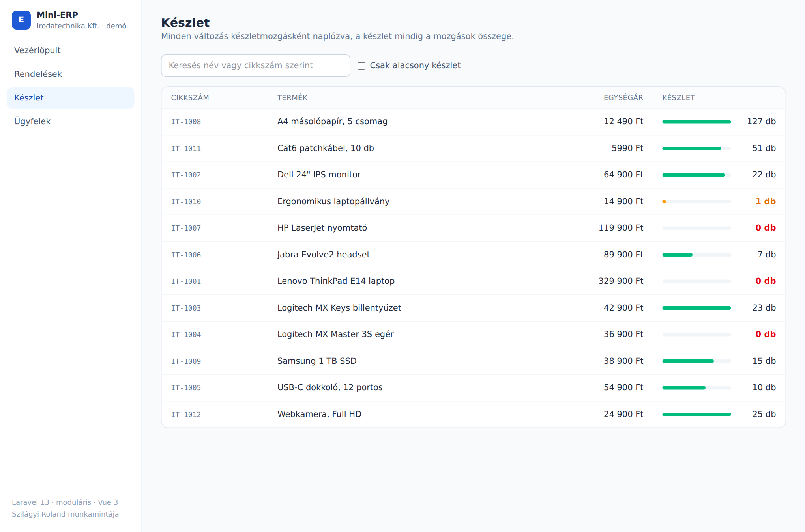 | 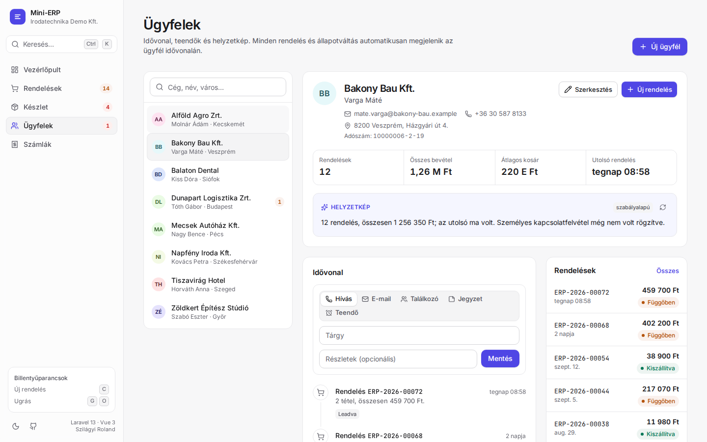 |
| **Webshop: marketingforrás, beérkezett rendelések** | **Sötét mód** |
| 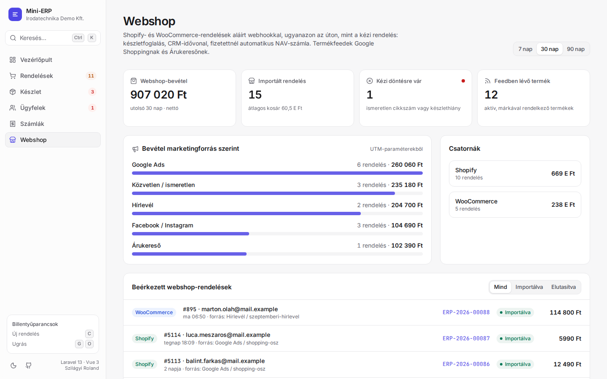 | 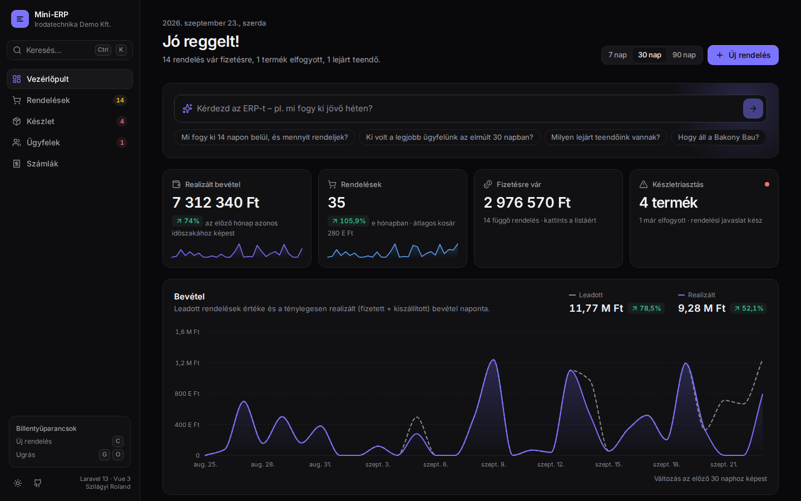 |
| **Mobil** | |
| 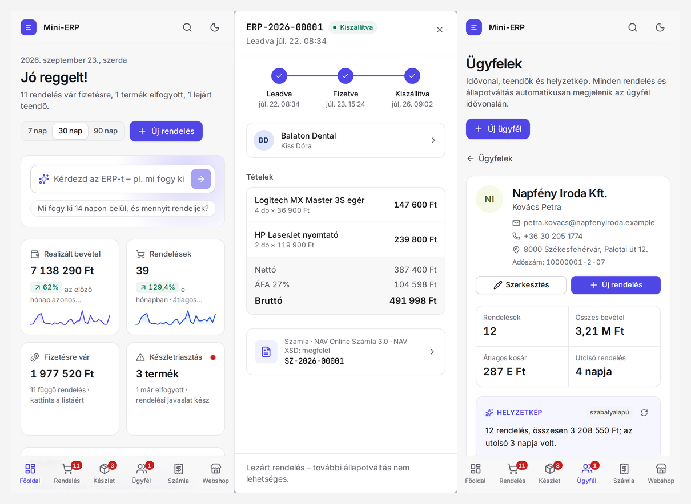 | |

## Mit csinálnék a következő sprintben

- Sztornó számla (`STORNO` módosító okirat) a `storno_required` számlákhoz, és a NAV-tranzakció státuszának lekérdezése
- Hitelesítés Sanctummal, szerepkörök Policy-kkel (raktáros / értékesítő / könyvelő)
- Valós idejű vezérlőpult Laravel Reverbbel (új rendelés és készletváltozás push-ban)
- Kétirányú webshop-szinkron: készlet- és ár-visszaírás a Shopify/WooCommerce API-ba, sorba állított (queue) webhook-feldolgozás nagy forgalomhoz

## Fejlesztés

AI-asszisztált fejlesztéssel készült (Claude). Az üzleti szabályokat és a modulhatárokat a tesztek rögzítik, így minden döntés ellenőrizhető.

Minden cég, személy és adószám kitalált.
